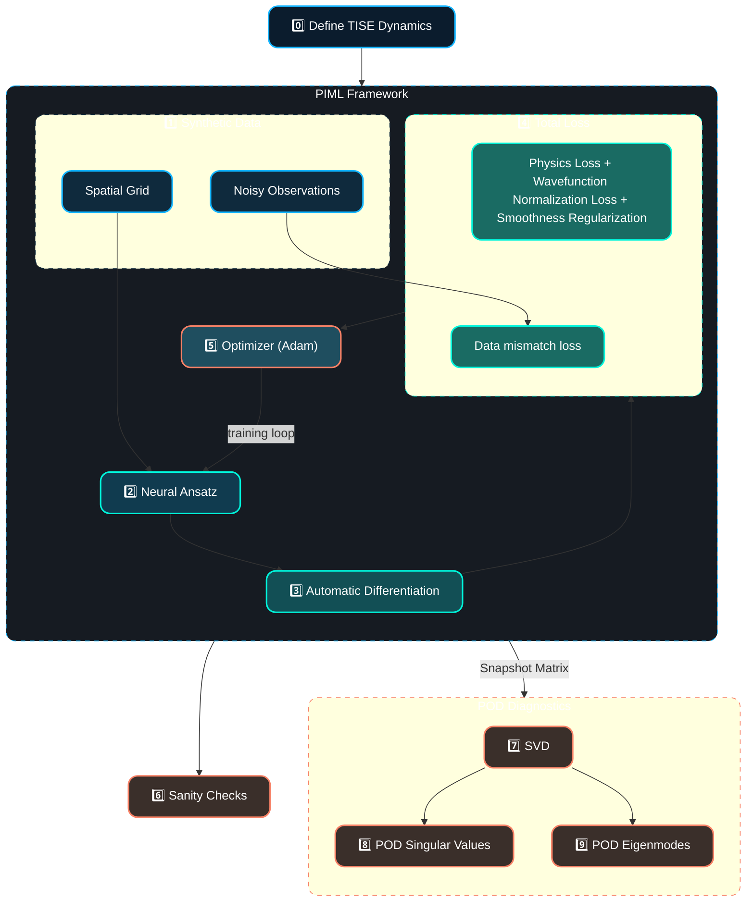
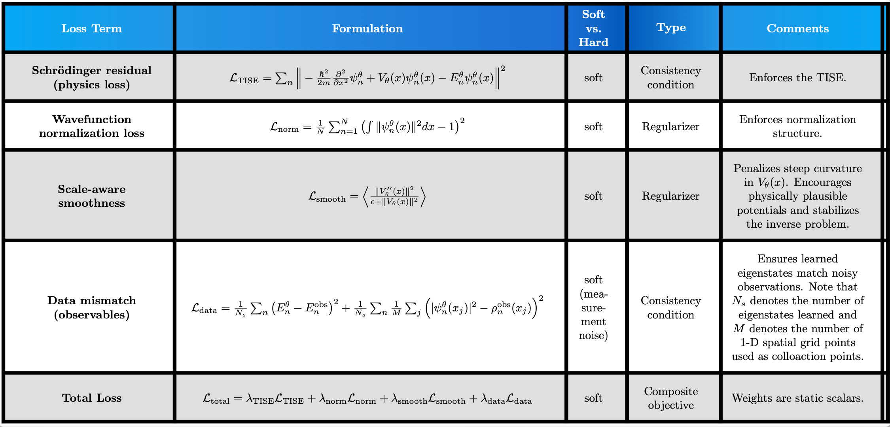

# inverse-piml-schrodinger

> 🥅 **Goal:** understand which operator features are robustly recoverable under strong physics priors and limited data.


This project extends the `lf-pinn-harmonic-oscillator` framework to an inverse quantum problem.
While project 1 investigated the robustness  of physics-informed neural networks (PINNs) under low fidelity discretization for a *known Hamiltonian*, this project is concerned with the information about an *unknown potential* that can be recovered from partial, noisy observations of quantum states.

Using the time-independent Schrödinger equation (TISE) as a physics constraint, we treat the potential $V(x)$ as a learnable function while wavefunctions act as auxiliary fields constrained by the PDE. The model is trained using noisy spectral data and probability densities, mimicking low-fidelity experimental measurements.

As with project 1, the goal is not high-precision reconstruction, but interpretability and identifability.

---
## Quick Start
```bash
pip install -r requirements.txt
python src/train.py --config ✅❓figure out what these are❓✅
```

---

## Repo Structure

```
inverse-piml-schrodinger/
├── README.md
├── requirements.txt
├── pyproject.toml
├── src/
│   ├── model.py            # neural network ansatz for V_theta(x)
│   ├── physics.py          # TISE residual, data mismatch, scale-aware smoothness
│   ├── inverse.py          # inverse-specific losses
│   ├── pod.py              # POD decomposition + reconstruction
│   ├── train.py            # training loop and CLI
│   ├── visualizations.py   # visualization utilities (e.g., seeding and grids)
│   └── utils.py            # helper functions (e.g., seeding and grids)
├── notebooks/
│   └── demo.ipynb        # visual + narrative
├── references/
│   ├── README.md         # a blank README.md idk what for though ❓
│   └── references.bib    # sources 
├── assets/
│   ├── images/
│   │   └── interpratibility_axis.png    
└── artifacts/
    ├── notes.md                         # conceptual notes and reflection
    ├── figures.md                       # structure-based analysis of demo visuals
    └── demo_visuals/    
        ├── density.png
        ├── learned_energies.png
        ├── learned_potential.png
        ├── learned_wavefunctions.png
        ├── overlap_heatmap.png
        ├── pod_modes.png
        ├── pod_singular_values.png
        └── training_curves.png                       
```

---
## 🏗️ PIML Architecture


### 🗺️ Mathematical Mapping for PIML Architecture
#### 0️⃣ Problem Setup - The 1D time-independent Schrödinger equation (TISE)
##### Mathematical Formulation:
$$-\frac{1}{2}\frac{d^2}{dx^2}\psi_n(x) + V(x)\psi_n(x)=E_n\psi_n(x), \quad x\in[-5,5]$$

> 📝 The overall goal is to learn an unknown potential $V(x)$, unknown wavefunctions $\psi_n$ and their associated energy eigenvalues $E_n$ from noisy, low-fidelity data.

#### 1️⃣ Synthetic Data - Physics enforcement via noisy observations
##### Mathematical Formulation:
$$x\in [-5,5] \quad \text{(spatial grid)}$$
$$\begin{align*}x\sim \mathcal{U}[-5,5] \\ \tilde{\psi}_n(x_i)=\psi_n^\text{true}(x_i)+\varepsilon_i, \quad \varepsilon\sim\mathcal{N}(0,\sigma^2) & \quad \text{(noisy observations)}\end{align*}$$

> 📝 Noisy observations simulate sparse experimental observations.

#### 2️⃣ Neural Ansatz - Learned potential and eigenstates
##### Mathematical Formulation:
$$V_\theta(x)=\text{MLP}_V(\theta_V;x)$$
$$\psi_n^\theta=\text{MLP}_\psi(\theta_\psi;x)$$
$$E_n^\theta=\text{learnable scalar}$$

#### 3️⃣ Automatic Differentiation - Recover the first and second partial deriviatives of the learned wavefunctions with respect to $x$
$$\frac{\partial}{\partial x}\psi_n^\theta$$
$$\frac{\partial^2}{\partial x^2}\psi_n^\theta$$

#### 4️⃣ Loss Function- Low fidelity PINN objective function with four loss terms
##### Mathematical Formulation:


#### 5️⃣ Optimization - Gradient descent update
##### Mathematical Formulation:
$$\theta \leftarrow \theta - \eta\nabla_\theta\mathcal{L}_\theta$$

#### 6️⃣ Sanity Checks - Validate the following:
- Orthogonality of learned eigenfunctions
- Energy ordering $E_0^\theta < E_1^\theta < E_2^\theta$
- Smoothness of learned potential
- Boundary decay behavior

> 📝 Sanity checks via figure analysis are an essential component of the sanity check process and for providing interpretable insights (see `./artifacts/figures.md`).

#### 7️⃣-9️⃣ Proper Orthogonal Decomposition (POD) Diagnostics - Take the SVD of the snapshot matrix for learned wavefunctions
##### Mathematical Formulation:
$$\mathbf{\Psi^\theta}=[\psi_0^\theta, \dots, \psi_{N-1}^\theta] \quad \text{(snapshot matrix)}$$

Taking the SVD of $\mathbf{\Psi^\theta}$ gives $$\mathbf{\Psi^\theta}=U\Sigma W^T$$
where 
- the columns of $U$ are POD modes of the learned eigenfunctions.
- the diagonal elements of $\Sigma$ are the corresponding singular values.
- ❓I don't really care about $W$ in this context, but what is the interpreation again?❓
> 📝 The spectrum (❓what does this refer to again in the context of the SVD?❓) reveals learned structure where large gaps in consecutive singular values indicate low-rank structure is learned correctly. 

> ✨ Importantly, POD does not enforce physics. It reveals structure. This is important for interpretability!
---
## 🌍 Global Design Choices
Assumptions:
- Atomic units: $\hbar = 1$
- Normalized parameters: $m = 1$ electron rest mass
- Wavefunction/eigenmode normalization is handled either implicitly or by the PDE
- probability density observations are on an absolute scale

What is being learned:
- The potential function $V_\theta(x) := V(\theta, x)$ via the MLP.
- Eigenmodes $\psi_n^\theta(x) := \psi_n(\theta,x)$ via the MLP. 
- Associated energy eigenvalues $E_n^\theta := E_n(\theta)$ as learnable scalars. 

Orthogonality
- For our low fidelity design, we are not _enforcing_ orthogonality directly.
- However, our POD function (`src/pod.py`) allows us to _diagnose_ orthogonality.

---
## 🔮 Future possible implementations
- unnormalized densities
- increase the number of learned eigenmodes
- partial observation windows
- Additional loss terms:
  - orthogonality constraints between $\psi_n(\theta,x)$ 
  - add energy ordering regularization
  - add symplectic loss
  - Dynamic weighting of the loss terms
    - 📝 For this project, the loss weights are assigned to a static `dict`. 
    - Plan of Action
      - Focus on data first, then enforce physics loss.
      - Prevent over-smoothing early during training.
      - **Adaptive balancing:** Compute the magnitude of each loss term every epoch and scale the $\lambda$'s so that all terms contribute roughly the same amount.
      - **Bayesian/ probabilistic sampling:** Treat each $\lambda$ as a learnable hyperparameter and update it with gradient descent.
    - Tips
      - Start with a static `dict` for the first pass. This will provide a baseline to compare against.
      - Add a **scheduler** only if you see a failure mode symptom.
    
        | **Symptom** | **Remedy**                                                       |
        | ----------- |------------------------------------------------------------------|
        | Physics residual stalls while the data-fit continues to improve. | Increase $\lambda_\text{physics}$.                               |
        | Flattening failure mode | Decrease $\lambda_\text{smooth}$ or slow down its schedule.      |
         | Wildly oscillating loss curves | Use a **smooth ramp** for all $\lambda$'s to stabilize training. | 
    
      - Log the effective $\lambda$ values each epoch and plot them alongside the training curves. This will help reveal whether a scheduler helped or hindered learning.
- use PySR architecture instead of 'pure' neural network (Crammer, 2023)
  - ✨ adds to interpretability discussion in `lf-pinn-inversse-schrodinger`

---
## ✅ To Do
- [ ] Figure 8 (bifurcation diagram) in `demo.ipynb`
- [ ] `figures.md`
  - Each figure should have:
    - Title
    - What is shown
    - What it tells us
    - Possible failure modes
    
    🔵 Example tone:
      > *"Figure 5 reveals partial orthogonality between learned eigenfunctions, despite no explicit orthogonality constraint. This suggests that the TISE residual alone imposes meaningful structure, though small off-diagonal overlaps indicate residual mode mixing."*
---
