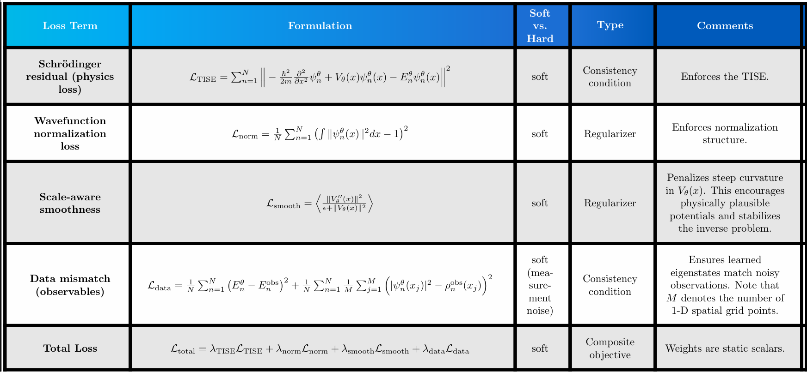

# Figure Analysis
## Figure 1 - Training Curves

> 🏡 The inverse problem converges to a stable multi-objective equilibrium. Physics residual and data mismatch are minimized concurrently, while normalization and smoothness constraint terms regulate solution geometry.
> 
> Training dynamics exhibit staged constraint resolution:
>   - Early objective competition
>   - Mid-stage geometry stabilization
>   - Late-stage oscillatory constraint enforcement as normalization corrections stabilize the solution manifold.
>     - 📝 Similar staged dynamics were observed in [Project 1 (Figure 1)](https://github.com/Scriber-Labs/lf-pinn-harmonic-oscillator/blob/main/artifacts/figures.md), suggesting consistent constraint geometry behavior across problem classes.

  

---

## Figure 2 - Learned Potential $V_\theta(x)$ vs. Ground Truth Potential $V(x)$ (Harmonic Oscillator)

### 🔑 Key Take-Aways
- **Smoothness prior effect:**  Regularization of $\mathcal{L}_\text{smooth}$ encourages low-curvature solutions, guiding $V_\theta(x)$ toward a geometrically stable solution state.
- **Inverse problem non-uniqueness:** The inverse Schrödinger problem is fundamentally ill-posed. Specifically, the same finite set of eigenfunctions and associated eigenvalues can be produced by multiple potentials.
  - $\mathcal{L}_\text{smooth}$ helps guide the model to a physically plausible solution (e.g., no sharp curvature artifacts).
  - However, $\mathcal{L}_\text{smooth}$ does not guarantee uniqueness!!
- **Domain-dependent identifiability:** Divergence near boundaries arise due to the wavefunctions having negligible amplitude in those regions. 
  - This results in:
    - Numerical weakening of the physics residual.
    - Data set provides minimal constraint in these regions.
    - The smoothness term biases the solution toward flattening.
  > 🏡 Thus, the potential is identifiable primarily within the spectral support of the trained eigenstates.

### ✖️ Failure Modes
- **Bias vs. variance tradeoff:** 
  - If $\lambda_\text{smooth}$ is too large, **over-smoothing** (bias) occurs. In the extreme case, **flattening** occurs and $V_\theta \rightarrow \text{const}$.
  - If $\lambda_\text{smooth}$ is too small, noisy perturbations and high-frequency artifacts emerge in $V_\theta(x)$.
- **Boundary artifacts** are more likely to manifest due to the model being less constricted near the boundaries (see domain-dependent identifiability).

---

> 🏡 Together, Figure 1 and Figure 2 suggest the low-fidelity PINN formulation aligns operator spectrum, solution support, and constraint geometry into a stable, interpretable equilibrium.
---

## Figure 3 - Learned Wavefunctions $\psi_n^\theta(x)$ vs. Ground Truth Wavefunctions $\psi_n(x)$ (Quantum Harmonic Oscillator)

> 🏡 The learned operator demonstrates spectral alignment across multiple eigenmodes, recovering correct parity, node structure, and envelope geometry.

### 🔑 Key Take-Aways
- **Phase ambiguity:** Overall sign flips are physically irrelevant due to global phase invariance.
- **Shape consistency:** Learned eigenfunctions retain correct Gaussian envelope structure.
- **Node structure:** Zeros align accurately with ground truth analytical solutions. This indicates correct operator curvature.

---

## Figure 4 - Learned vs. Ground Truth Energy Eigenvalues 

> 🏡 The learned operator preserves spectral spacing and ordering across the first three wavefunctions.

### 🔑 Key Take-Aways
- **Energy ordering preserved:** No mode swapping or spectral collapse.
- **Approximate linear spacing retained:** Indicates correct quadratic curvature in $V_\theta(x)$.
- **Small systematic bias:** Slight underestimation of extreme modes suggests mild curvature underfitting. This is consistent with smoothness regularization.
---

## Figure 5 - Learned vs. Noisy Observed Probability Densities

> 🏡 Inferred probability densities $|\psi_n^\theta(x)|^2$ vs. fake observed probability densities $\rho_n^\text{obs}(x)$ for the first three eigenmodes. Despite observational noise, the learned operator preserves node structure, parity, and multi-lobe geometry across modes $n=0,1,2$.

### 🔑 Key Take-Aways:
- **Node alignment:** Zero crossings are accurately recovered despite noisy (indirect) supervision.
- **Spectral geometry preservation:** Lobe count and parity structure match analytical solutions.
- **Controlled amplitude bias:** Slight peak underestimation and mild broadening are consistent with regularization under noisy data.
- **Observable robustness:** Agreement in $|\psi|^2$ indicates stable operator recovery from corrupted measurements.
- **Data anchoring:** The observational density loss term prevents arbitrary drift in function space by constraining the learned states to match measurable structure. Note this is a *partial* anchor; not a full identification constraint.
- **Indirect supervision:** The model must $\psi$ such that its squared magnitude matches data, while also satisfying the PDE constraint. 
- **Phase remains unconstrained:** Loss is invariant under $\psi \rightarrow -\psi$.

---
# POD Diagnostics

> 💡**Big Idea:** POD does not enforce physics. It reveals structure.

## Figure 6 - Overlap Heatmap

  

> 🏡 $\langle\psi_m^\theta | \psi_n^\theta\rangle \approx \delta_{mn}$ provides evidence that the learned operator remains spectrally consistent across modes. This indicates the learned model is not just interpolating; it is learning a coherent quantum operator. 

### 🔑 Key Take-Aways
#### Near-orthogonality emerges naturally 
  - The overlap heatmap tell us $\langle\psi_m^\theta | \psi_n^\theta\rangle \approx \delta_{mn}$.
  - These results agree with the expected structure of the eigenfunctions of a Hermitian Hamiltonian.
  - Explicit orthogonality constraints are absent from the PIML architecture.

#### Linear independence and distinctness of learned eigenfunctions
  - Nonzero determinant indicates linear independence.
  - Small off-diagonal values indicate distinct learned eigenfunctions.

#### Coupling through the shared potential $V_\theta(x)$

- All $\psi_n^\theta(x)$ are solutions of the same operator $$\hat{H}_\theta=-\frac{1}{2}\frac{\partial^2}{\partial x^2} + V_\theta(x) \, .$$ 
- Note that $\hat{H}_\theta$ is global across all modes.

#### Error propagation across eigenstates
  - Since the potential is shared, any error in $V_\theta(x_0)$ propagates to every eigenfunction with support near $x_0$.
  - This induces correlated errors across learned eigenstates, which may manifest as
    - Slight systematic energy bias.
    - Consistent wavefunction broadening across learned eigenfunctions.
    - Non-zero off-diagonal overlaps (if $\hat{H}_\theta$ is poorly learned).
---

## Figure 7 - POD Diagnostics 
### Figure 7a - POD Singular Values

> 🏡 The POD singular values of the learned eigenmode matrix $\mathbf{\Psi^\theta}$ have values close to unity. This indicates that the learned eigenfunctions form a well-conditioned and nearly orthonormal basis. These results independently confirm the spectral consistency observed in the overlap matrix (Figure 6).

### Figure 7b - POD Spatial Modes vs. Learned Wavefunctions vs. Ground Truth Wavefunctions

> 🏡 The POD spatial modes extracted from the learned eigenfunction matrix reveal that the dominant spatial patterns closely align with linear combinations of the learned eigenfunctions.

### 🔑 Key Take-Aways
#### Learned eigenfunctions span the dominant spatial subspace.
- The POD spatial modes represent the principal spatial patterns shared across the learned dataset $\mathbf{\Psi^\theta}$.
- These spatial modes appear manifest as linear combinations of the learned eigenfunctions.
- This indicates that the learned eigenbasis already spans the dominant spatial structures present in the system.
- 
#### Well-conditioned learned eigenbasis.
- The singular values are all similar in magnitude.
- No single spatial mode dominates the SVD representation.
- This indicates that the learned eigenfunctions form a well-conditioned basis with minimal redundancy.

#### Learned basis differs from teh physical eigenbasis but still captures the system.
- The POD spatial modes do not align with individual eigenfunctions.
- Instead, they emerge as mixtures that optimally represent the spatial variance in the learned dataset.
- Despite this rotation of the learned eigenbasis, the learned eigenfunctions still accurately reproduce the observed probability densities (Figure 5).

#### Consistency with the learned quantum operator
- Similarity between POD spatial modes and learned eigenfunctions suggests that the learned eigenbasis sufficiently captures the dominant spatial structures generated by $\hat{H_\theta}$.
- Together with the conclusion from Figure 7a (well-conditioned spectrum), this suggests that the learned operator is geometrically consistent.

## Figure 7c - $\langle u_k | \psi_n^\theta\rangle$ Overlap Matrix

  

> 📝 Columns correspond to learned wavefunctions $\psi_n^\theta$ and rows correspond to POD eigenmodes $u_k$.

### 🔑 Key Take-Aways

#### POD mode 0

$$u_0 \approx 0.97\psi_2^\theta$$
- Tells us the learned eigenstate with the highest energy contributes the largest spatial variance in the dataset.
- This agrees with physical ground truth since higher eigenstates oscillate more.

#### POD mode 1

$$u_1 \approx -0.79\psi_1^\theta - 0.57\psi_2^\theta$$
- Tells us this mode is primarily a mixture of excited learned eigenstates.

#### POD mode 2

$$u_2\approx -0.81\psi_0^\theta$$
- Tells us the learned ground-state contributes the least spatial variance in the dataset.
- This agrees with the physical ground truth since lower eigenstates oscillate less.

# Conclusions (POD Analysis)
| **Diagnostic** | **Measurement** |
|----------------|-----------------|
| Figure 6 | orthogonality of learned eigenfunctions |
| Figure 7a | conditioning of eigenbasis |
| Figure 7b | spatial structure of modes |
| Figure 7c | relationship between POD modes and learned eigenbasis|

### Specific Questions POD Answers

| 🧙🏻‍♂️ Question                                                                                                      | ✨ Relevance            | ✔️ Answer     | 🖼️ Figure(s) | 💬 Comments                                                                                                                                                                                                                                                                                        | 🧠 Interpratibility                                                             |
|-----------------------------------------------------------------------------------------------------------------------|------------------------|---------------|---------------|----------------------------------------------------------------------------------------------------------------------------------------------------------------------------------------------------------------------------------------------------------------------------------------------------|---------------------------------------------------------------------------------|
| Are $\psi_n^\theta(x)$ distinct or collapsing?                                                                        | Detects mode collapse  | distinct      | Figure 6      | Flattening of learned wavefunctions occurs without wavefunction normalization loss term.     Moreover, the smoothness regularization term keeps the learned potential structurally constrained so that curvature isn't too steep.                                                          | Orthogonality is (approximately) observed in learned wavefunctions.             |
| How many effective modes exist?                                                                                       | Identifiability        | 3             | Figure 6      | All singluar values are near unity.                                                                                                                                                                                                                                                                | No single spatial mode dominates the data matrix.                               |
| Are learned eigenstates redundant?                                                                                    | Overparameterization   | not redundant |               |                                                                                                                                                                                                                                                                                                    |                                                                                 |
| Do spatial modes align with energy ordering? | Model consistency      |               |               |                                                                                                                                                                                                                                                                                                    |                                                                                 |
| Is orthogonality emerging naturally?                                                                                  | Structural consistency | yes           | Figure 6      | Importantly, this architecture does NOT enforce $\langle \psi_m^\theta , \psi_n^\theta \rangle=\delta_{mn}$. However, we observe near-orthogonality in Figure 6.    This result is structurally consistent with Hermitian operators (orthogonal eigenfunctions with distinct eigenvalues). | The learned potential is consistent enough to preserve orthogonality structure. |

---
## ✨ General Insights (Figures 2-7)
> #### 🧠 Big Interpretation Insight: Three (Four ❓) 'layers' of structure

| **Layer**          | **Interpretation**     | **📝 Notes**                                           |
|--------------------|------------------------|--------------------------------------------------------|
| 1️⃣                | data fidelity          |                                                        |
| 2️⃣                | observable consistency | $\|\psi_n^\theta \|^2$ matches noisy data              |
| 3️⃣                | spectral geometry      | nodes, parity, and ordering are preserved              |
| 4️⃣  POD analysis (❓) | operator coherence     | near-orthogonality and energy spacing naturally emerge |
