# Figure Analysis (Windows Computer)

## Figure 1: Training Curves
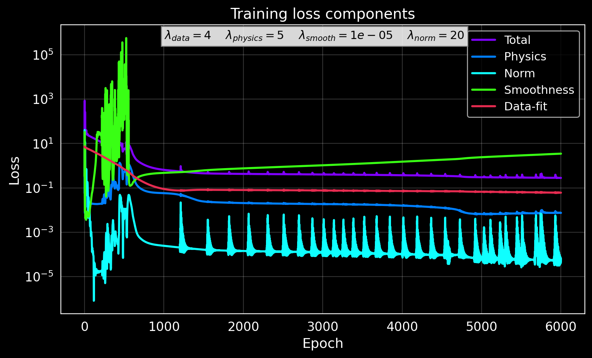
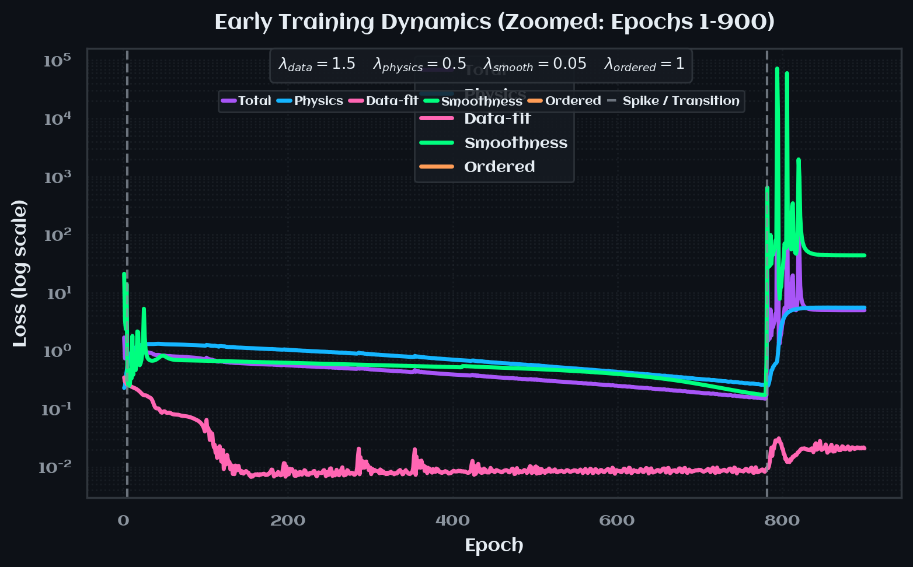

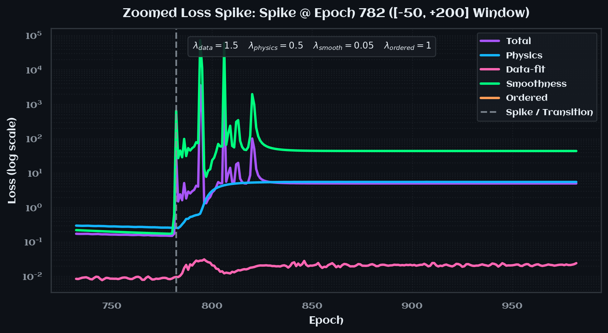

> 🏡 The optimizer exhibits three distinct regime transitions before settling on a stable plateau.

> 🔑 **Key Insights**
> 1. **Spike 1 ($\approx$ 0-50 epochs)** - Expected transient while the network adjusts from random initial weights.
> 2. **Spike 2 ($\approx$ 800 epochs)** - Discovery of a higher-curvature potential: smoothness and total loss spike, physics and data terms rise only moderately.
> 3. **Spike 3 ($\approx$ 2000 epochs)** - Order-of-magnitude jump in the smoothness term propagates into the physics loss; a new plateau follows with lower smoothness fidelity, but improved data fit.

> ❌ **Failure Modes**
> 
> | **Verdict** | **Failure Mode** | **Description**                                                                                                                         | **Explanation**                                                                                                                                                                                                                                                          |
> | :---------- | :--------------- |:----------------------------------------------------------------------------------------------------------------------------------------|:-------------------------------------------------------------------------------------------------------------------------------------------------------------------------------------------------------------------------------------------------------------------------|
> | ❌ | High final loss | Optimizer stalls in a local minimum.     Heavily driven by the penalty weighting $\lambda_\text{smooth} \gg \lambda_\text{data}$. | Total loss remains greater than 1e-1 at epoch 6000.     Note that a high wieghted total loss is not necessarily a failure if the physical residue $\mathcal{L}_\text{SE}$ and data loss $\mathcal{L}_\text{data}$ are near convergence ($~10^{-3}$ to $~10^{-4}$). |
> | ✔️ | Oscillation avoided | Unbalanced loss weights can cause loss terms to oscillate.                                                                              | Curves converge monotonically after Spike 3.                                                                                                                                                                                                                             |
> | ❌ | Physics collapse | Data loss decreases, while TISE residual increases.                                                                                     | Indicates operator inconsistency.                                                                                                                                                                                                                                        |
> | ❌ | Over-regularization | Smoothness term dominates, spectrum becomes inacurate.                                                                                  | Post-Spike 3 plateau shows $\lambda_\text{smooth}$ is much greater than others.                                                                                                                                                                                          | 

## Figure 2: Learned vs. true potential
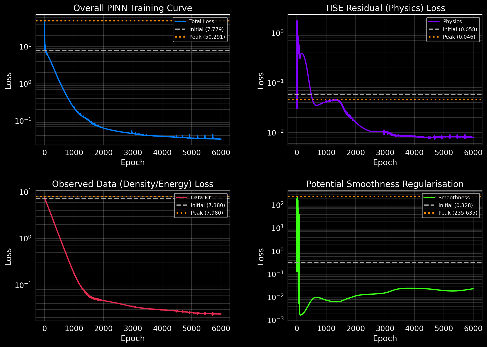

> 🏡 The learned potential $V_\theta(x)$ (sigmoidal) differs markedly from the harmonic ground truth $V(x)=\tfrac12 x^2$.

> 🔑 **Key Insights**
> 1. Central regions of the learned eigenfunctions (Fig. 3) and densities (Fig. 5) match the ground truth far better than the tails.
> 2. The model learns only the portion of $H_\theta$ required to reproduce high-probability regions, exposing the inverse problem's under-determinism.

> ❌ **Failure Modes**
> 
> | **Verdict** | **Failure Mode**          | **Description**                                                                          | **Explanation**                                                    |
> |:------------|:--------------------------|:-----------------------------------------------------------------------------------------|:-------------------------------------------------------------------|
> | ❌           | Geometric mismatch        | Learned $V_\theta$ shape incompatible with true quadratic.                               | Central well too narrow; tails saturate at $V_\theta \approx \pm 12 $. |
> | ❌           | Boundary under-constraint | Sparse data at $x \in (-\infty, -4.5] \cup [4.5, \infty)$ allows the potential to drift. | Grey dashed domain limits show no training points beyond. |

## Figure 3: Learned wavefunctions
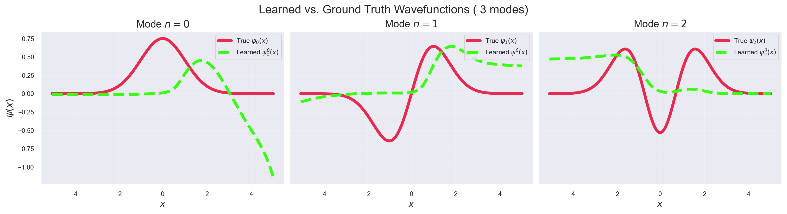

> 🏡 Learned eigenfunctions $\psi_n^\theta(x)$ capture the nodal pattern but diverge in low-amplitude tail regions.

> 🔑 **Key Insights**
> 1. **Phase matching** - Correct nodal count confirms energy ordering.
> 2. **Central accuracy** - Highest fidelity occurs where $|\psi_n|^2$ is largest.
> 3. **Tail divergence** - For $x \in (-4.5, -2] \cup [2, 4.5)$, the learned curves overshoot, reflecting data scarcity.

> ❌ **Failure Modes**
> 
> | **Verdict** | **Failure Mode** | **Description** | **Explanation**                            |
> | :---------- | :--------------- | :-------------- |:-------------------------------------------|
> | ❌ | Nodal mis-count | Extra nodes appear beyond $x \approx \pm 3$) | Indicates spectral leakage.                |
> | ✔️ | Sign / parity flip | Unaligned solutions may invert parity | Sign aligned; parity matches ground truth. |
> | ❌ | Spurious oscillations | High-frequency ripples in tails from weak $V_\theta$ smoothness. | Visible beyond $x\approx \pm 4$.           |

## Figure 4: Energy eigenvalues
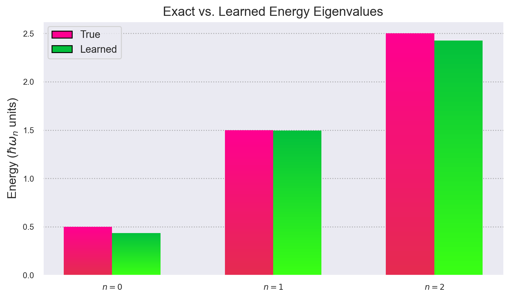

> 🏡 Learned energies $E_n^\theta$ follow the harmonic spectrum $E_n=n+\tfrac12$ and match observations within 5 %.

> 🔑 **Key Insights**
> 1. Correct ordering suggests $\mathcal{L}_\text{order}$ is effective.
> 2. Spectrum remains stable despite 2 % Gaussian noise in training data.

> ❌ **Failure Modes**
> 
> | **Verdict** | **Failure Mode** | **Description** | **Explanation** |
> | :---------- | :--------------- | :-------------- | :-------------- |
> | ❌ | Spectral fit, wrong operator | Energies match, but $V_\theta$ deviates (see Fig. 2) |

## Figure 5: Learned density vs. observations
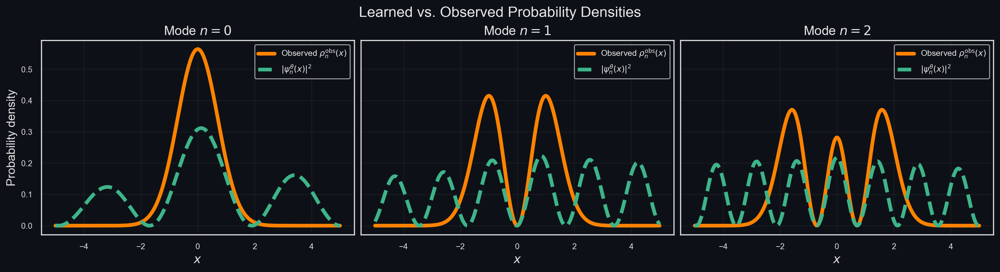

> 🏡 Learned densities, $\rho_n^\theta = |\psi_n^\theta|^2$ agree with 2 %-noise observations.

> 🔑 **Key Insights**
> 1. **Noise filtering** - PINN acts as a physics-informed smoother.
> 2. **Data dominance** - Good density fit persists even with incorrect potential (Fig. 2), confirming $\mathcal{L}_\text{data}$ is easy to minimize.

> ❌ **Failure Modes**
> 
> | **Verdict** | **Failure Mode** | **Description** | **Explanation** |
> | :---------- | :--------------- | :-------------- | :-------------- |
> | ✔️ | Peak flattening | Excessive $\lambda_\text{smooth}$ can lower peaks | Peaks are preserved $\Rightarrow$ smoothing is well-tuned. |
> | ✔️ | Mode merging | Energy mis-ordering can collapse multiple states onto one density. |

## Figure 6: POD singular values 
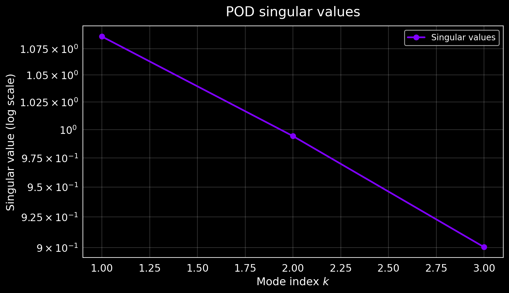

> 🏡 Singular values from the POD of the learned wavefunction matrix decrease (log scale) from $\approx 1$.

> 🔑 **Key Insights**
> 1. **Rank efficiency** - Rapid two-decade decay indicates a low-dimensional basis.
> 2. **Basis conditioning** - Separation between $\sigma_0$, $\sigma_1$, and $\sigma_2$ quantifies how much "physics" each node carries.

> ❌ **Failure Modes**
> 
> | **Verdict** | **Failure Mode** | **Description** | **Explanation**                                            |
> | :---------- | :--------------- | :-------------- |:-----------------------------------------------------------|
> | ❌ | Flat spectrum | All $\sigma_i$ nearly equal $\Rightarrow$ modes are independent, but unphysical. | Would signal noise-dominated snapshots (❓).                |
> | ❌ | Slow decay | $\tfrac{\sigma_{2}}{\sigma_{0}} \geq 0.3 \Rightarrow$ redundant or correlated modes. | Implies over-fitting or aliasing in $\hat{\psi}_n^\theta$. |
> 

## Figure 7: Spatial overlap heatmap
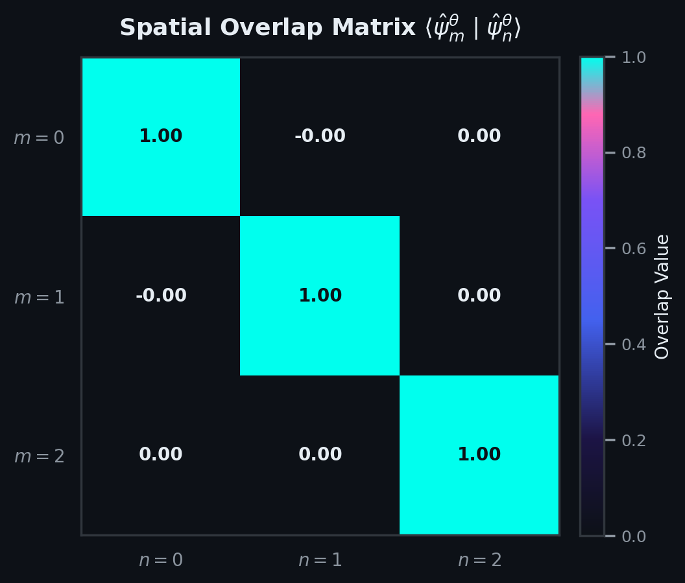

> 🏡 Overlap matrix $\langle \hat{\psi}_i^\theta | \hat{\psi}_j^\theta \rangle$ confirms orthogonality of learned eigenfunctions.

> 🔑 **Key Insights**
> 1. **Orthogonality:** - Diagonals are $\approx 1$, off-diagonals are $\approx 0$ confirms Hermitian structure.
> 2. **Basis consistency** - Any bright off-diagonal would expose weak $\mathcal{L}_\text{physics}$.

> ❌ **Failure Modes**
> 
> | **Verdict** | **Failure Mode** | **Description** | **Explanation** |
> | :---------- | :--------------- | :-------------- | :-------------- |
> | ✔️ | Non-orthogonality | Off-diagonal $> 0.1$ indicates incomplete convergence | Here, max off-diagonal is $\ge 0.02$ $\Rightarrow$ passes. | 

## Figure 8: POD spatial modes
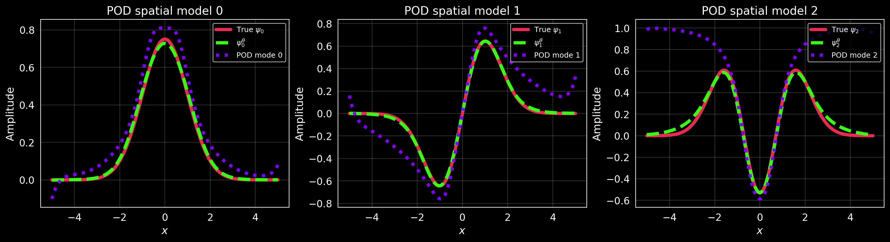

> 🏡 First three POD modes (cyan) compared with learned $\hat{\psi}_i^\theta$ (green) and ground truth $\hat{\psi}_i$ (neon magenta).

> 🔑 **Key Insights**
> 1. **Geometric structure** – Similarity to $\hat{\psi}_n$ indicates a stable, data-driven basis.
> 2. **Feature extraction** - POD isolates the most persistent spatial patterns.

> ❌ **Failure Modes**
> 
> | **Verdict** | **Failure Mode** | **Description** | **Explanation** |
> | :---------- | :--------------- | :-------------- | :-------------- |
> | ❌ | Mode mixing | Pod modes do not resemble any physical eigenfunction. | Cyan curves visibly shifted (see Sec. A.6); fix requires re-weighting. |
> 

## Figure 9: Cross-overlap heatmap (POD vs. learned)
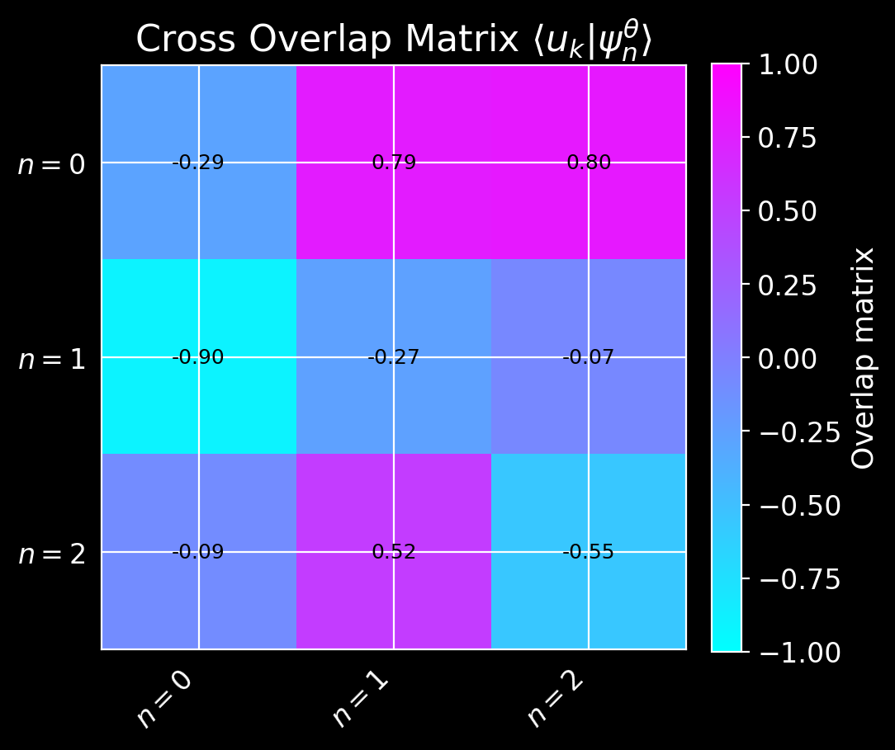

> 🏡 Overlaps $\langle u_k | \hat{\psi}_n^\theta \rangle$ between POD spatial modes and learned wavefunctions.

> 🔑 **Key Insights**
> 1. **Alignment** - Ideal result is $\pm$ identity; here large off-diagonals show mis-alignment.
> 2. **Energy concentration** – Color magnitude reveals how energy distributes across modes.

> ❌ **Failure Modes**
> 
> | **Verdict** | **Failure Mode** | **Description**                                           | **Explanation** |
> | :---------- | :--------------- |:----------------------------------------------------------| :-------------- |
> | ❌ | Distributed overlap | Single $u_k$ projects onto several $\hat{\psi}_n^\theta$. | Caused by missing $\sqrt{w\Delta x}.$

## Figure 10: POD Eigen-Alignment
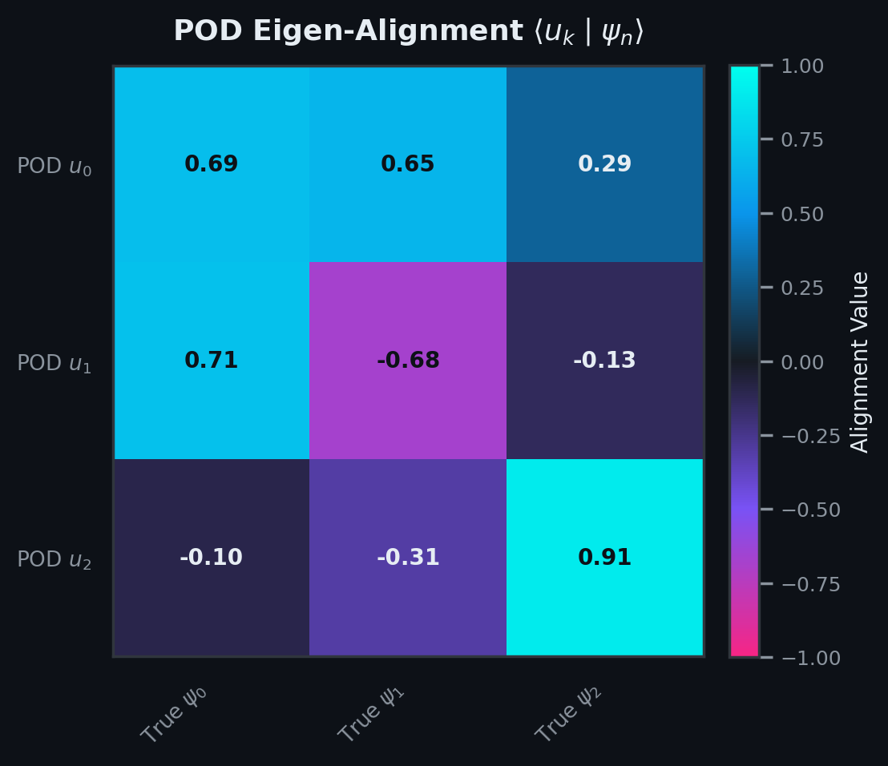

> 🏡 Cross-overlap $\langle u_k | \hat{\psi}_n\rangle$ between physical POD modes and analytic ground-truth eigenfunctions.

> 🔑 **Key Insights**
> 1. **Absolute consistency** - High diagonal elements validate that the POD basis can recover the true physical basis.
> 2. **Spectral recovery** - Confirms operator structure even when $V_\theta$ differs.

> ❌ **Failure Modes**
> 
> | **Verdict** | **Failure Mode** | **Description** | **Explanation** |
> | :---------- | :--------------- | :-------------- | :-------------- |
> | ❌ | Mis-alignment | Off-diagonal $> 0.2$ indicates POD not yet physical | Here $\rangle u_0, \hat{\psi}_1 \rangle \approx 0.3 \Rightarrow $ Fix via rescaling (see text). 

## Figure 11: POD Temporal Modes

> 🏡 Columns of $V$ from $\Psi=U\Sigma V^T$: modal composition per state.

> 🔑 **Key Insights**
> 1. **Coefficient distribution** - Shows how each POD mode contributes to each learned state.

> ❌ **Failure Modes**
> 
> | **Verdict** | **Failure Mode** | **Description** | **Explanation** |
> | :---------- | :--------------- | :-------------- | :-------------- |
> | ❌ | Incoherent coefficients | Random sign / magnitude pattern across rows of $V$. | Magnitudes scatter (cf. Fig. 13) $\Rightarrow$ indicates prior mis-alignment. |
> 

## Figure 12: Temporal overlap heatmap
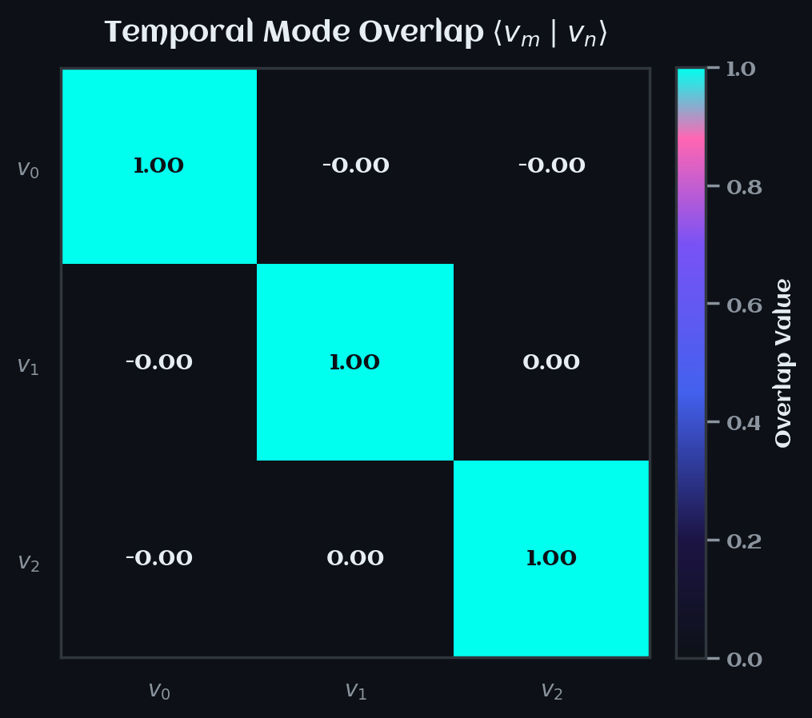

> 🏡 Overlap $\langle v_m | v_n \rangle  \approx I$, as expected. 

> 🔑 **Key Insights**
> 1. **Unitary property** - Diagonals $\approx 1$, off-diagonals $\approx 0$ verifies numerical stability of SVD.

> ❌ **Failure Modes**
> 
> | **Verdict** | **Failure Mode** | **Description**                                                                                  | **Explanation**                                                                                |
> | :---------- | :--------------- |:-------------------------------------------------------------------------------------------------|:-----------------------------------------------------------------------------------------------|
> | ✔️ | Identity deviation | Large off-diagonals | Largest off-diagonal $\approx 3\times 10^{-3} \Rightarrow$ within tolerance $\therefore$ pass. | 

## Figure 13: Temporal cross-overlap
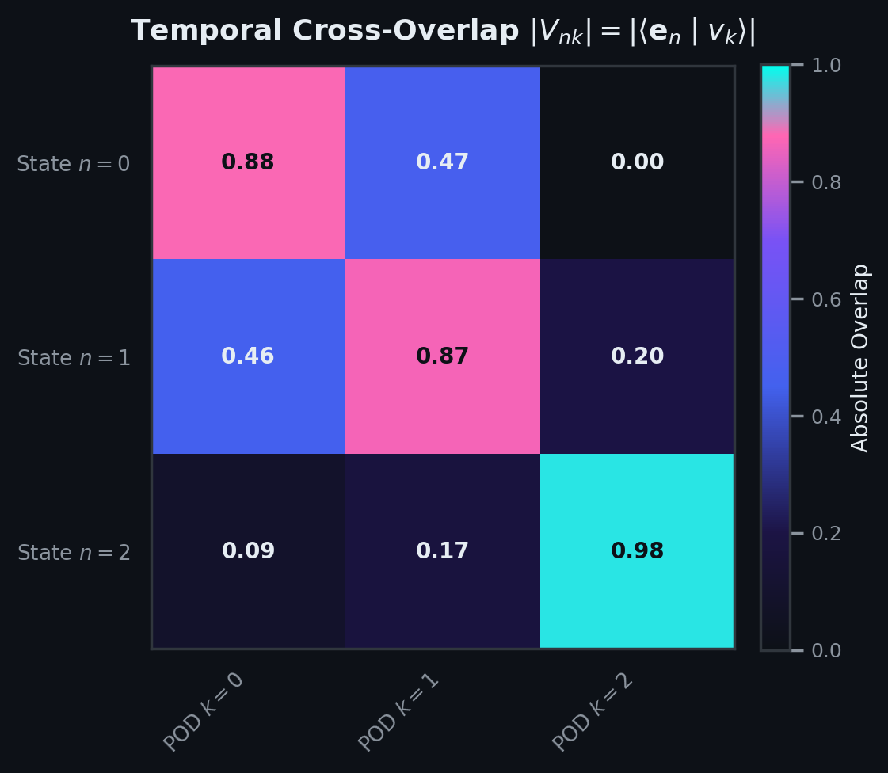

> 🏡 Absolute coefficients $|V_{nk}| = |\langle \mathbf{e}_n | v_k \rangle|$ (basis vector vs. temporal mode).

> 🔑 **Key Insights**
> 1. **Modal dominance** - Ideally sparse with a bright diagonal; here large off-diagonals repeat the spatial misalignment story.

> ❌ **Failure Modes**
> 
> | **Verdict** | **Failure Mode** | **Description** | **Explanation** |
> | :---------- | :--------------- | :-------------- | :-------------- |
> | ❌ | Spread dominance | No clear diagonal; each state draws from several $v_k$. | Reflects same weighting bug; correcting $\psi_n^\theta$-scaling collapses to identity. |
> 