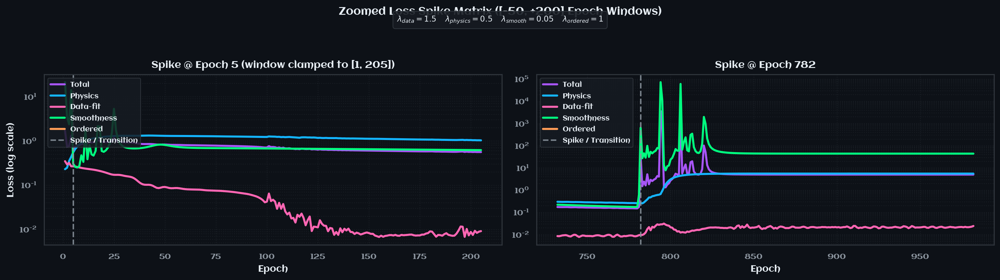
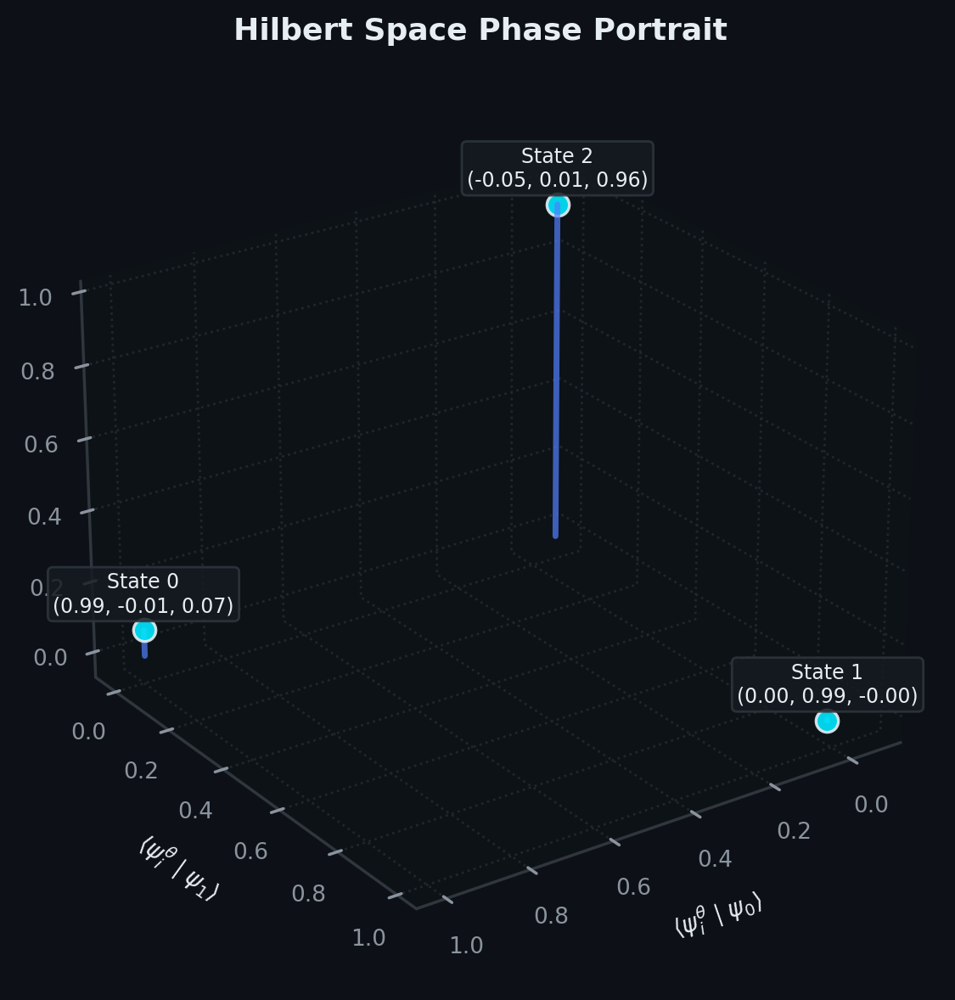
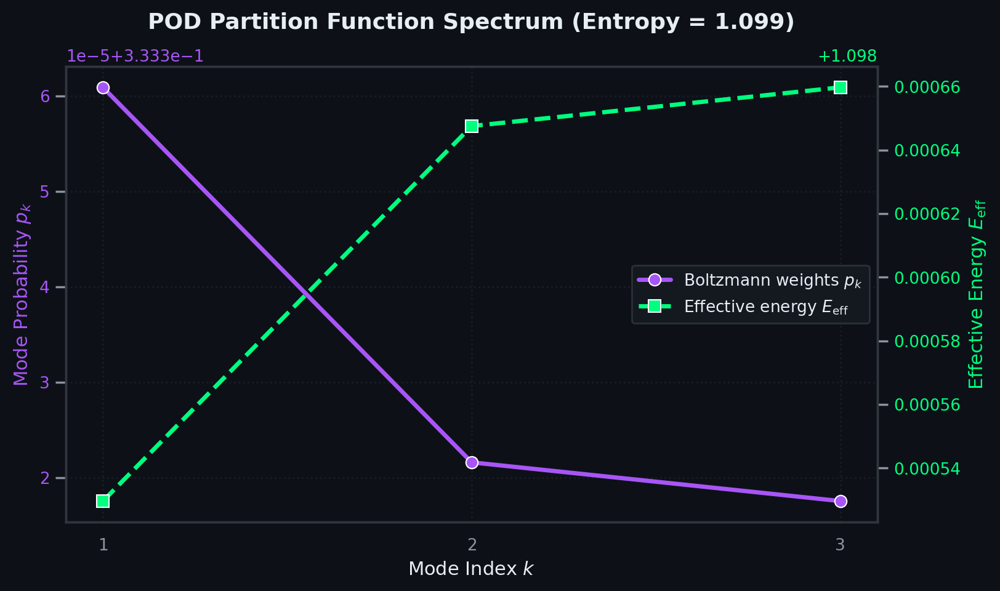
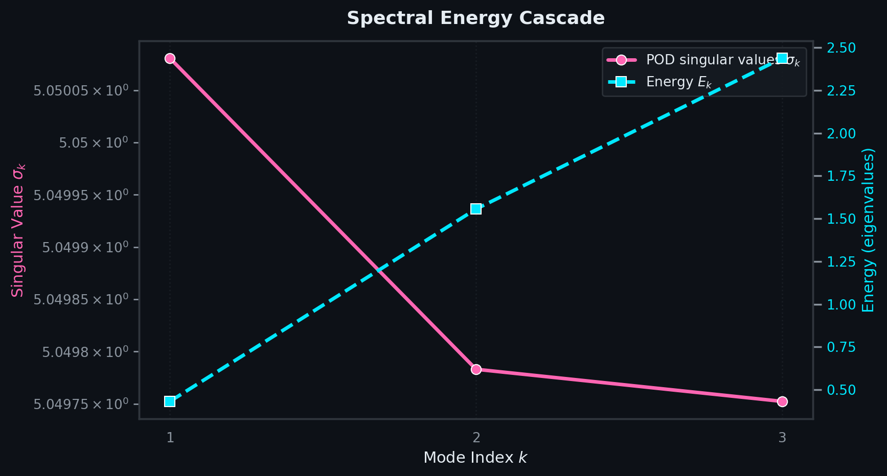

# Figure Re-Evaluation Analysis

## Figure 1: Training Curves

> 🏡 The optimization trajectory displays two primary transition spikes before settling into an invariant plateau after epoch 800.

> 🔑 **Key Insights**
> 1. **Spike 1 (Epoch 5, window [1, 205])** - Initial parameter adaptation transient from randomized initialization, after which data loss decreases below $10^{-1}$ and physics loss smoothly declines towards $10^{-1}$.
> 2. **Spike 2 (Epoch 782, window [732, 982])** - Severe instability triggered by a massive spike in the smoothness loss term ($\mathcal{L}_\text{smooth} > 10^4$), directly forcing the physics loss $\mathcal{L}_\text{physics}$ and total loss up to $\approx 5.0$.
> 3. **Post-Transition Invariant Plateau (Epochs 800–6000)** - All loss components remain strictly constant: total loss $\approx 5.0$, smoothness loss $\approx 40.0$, physics loss $\approx 5.0$, and data-fit loss $\approx 2.7 \times 10^{-2}$.

> ❌ **Failure Modes**
> 
> | **Verdict** | **Failure Mode** | **Description** | **Explanation** |
> | :---------- | :--------------- | :-------------- | :-------------- |
> | ❌ | High final loss | Optimizer stalls in a suboptimal local minimum. | Total loss freezes at $\approx 5.0$ and smoothness loss at $\approx 40.0$ through epoch 6000 without further descent. |
> | ✔️ | Oscillation avoided | Loss terms oscillate irregularly without reaching equilibrium. | Curves remain completely flat and non-oscillatory across epochs 800–6000. |
> | ❌ | Physics collapse | Low data loss coupled with persistently high TISE residual. | Data-fit loss converges to $\approx 2.7 \times 10^{-2}$, while physics residual stalls at $\approx 5.0$, reflecting operator inconsistency. |
> | ❌ | Smoothness trap | Smoothness penalty spike locks model into high-loss state. | Massive gradient spike at epoch 782 leaves smoothness loss permanently elevated at $\approx 40.0$. |

## Figure 2: Learned vs. true potential

> 🏡 The reconstructed potential $V_\theta(x)$ forms an asymmetric sigmoidal step rather than the symmetric harmonic oscillator potential $V(x) = \frac{1}{2}x^2$.

> 🔑 **Key Insights**
> 1. **Asymmetric Step Profile** - $V_\theta(x)$ plateaus at $\approx +7.5$ for $x < -1$, rapidly transitions across $[-1, 1]$, and saturates near $-7.7$ to $-8.0$ for $x > 1$.
> 2. **Domain Decoupling** - The model fails to recover the quadratic well geometry, yet manages to satisfy density matching in the central core region.

> ❌ **Failure Modes**
> 
> | **Verdict** | **Failure Mode** | **Description** | **Explanation** |
> | :---------- | :--------------- | :-------------- | :-------------- |
> | ❌ | Geometric mismatch | Learned $V_\theta(x)$ shape incompatible with quadratic ground truth. | Potential is an asymmetric step/tanh profile ($V_\theta \in [-8.0, +7.5]$) instead of a symmetric parabola ($V \in [0, 12.5]$). |
> | ❌ | Boundary under-constraint | Flattens into unphysical asymptotes away from origin. | Lack of high-density constraint for $|x| > 2$ allows the potential to drift into flat asymptotes. |

## Figure 3: Learned wavefunctions

> 🏡 Learned wavefunctions $\psi_n^\theta(x)$ accurately capture central modal features and parity, but exhibit spurious oscillations in the low-density tails.

> 🔑 **Key Insights**
> 1. **Parity Preservation** - Even parity for $n=0, 2$ and odd parity for $n=1$ are maintained.
> 2. **Core Confinement** - Close agreement with ground truth $\psi_n(x)$ in the central domain $|x| \le 1.5$.
> 3. **Peripheral Distortion** - Pronounced spurious oscillations and unphysical zero-crossings develop in the outer tails ($|x| > 2.0$).

> ❌ **Failure Modes**
> 
> | **Verdict** | **Failure Mode** | **Description** | **Explanation** |
> | :---------- | :--------------- | :-------------- | :-------------- |
> | ❌ | Nodal mis-count | Spurious zeros in outer boundaries. | Extra nodes appear for $|x| > 2.5$ across all three states due to tail ripples. |
> | ✔️ | Sign / parity flip | Parity inversion or global sign mismatch. | Parity and central signs match ground truth across all states. |
> | ❌ | Spurious oscillations | High-frequency ripples in low-density tail regions. | Amplitudes reach $\approx \pm 0.3$ in the wings due to flat asymptotic potential $V_\theta(x)$. |

## Figure 4: Energy eigenvalues

> 🏡 Learned energies follow the monotonic order $E_0 < E_1 < E_2$, with exact match at $n=1$ and small offsets at $n=0, 2$.

> 🔑 **Key Insights**
> 1. **Energy Values** - $E_0^\theta = 0.36$ (true $0.50$, error $-28\%$), $E_1^\theta = 1.50$ (true $1.50$, error $0.0\%$), $E_2^\theta = 2.40$ (true $2.50$, error $-4.0\%$).
> 2. **Order Enforcement** - Spectral ordering loss $\mathcal{L}_\text{ordered}$ successfully preserves strict monotonic separation.

> ❌ **Failure Modes**
> 
> | **Verdict** | **Failure Mode** | **Description** | **Explanation** |
> | :---------- | :--------------- | :-------------- | :-------------- |
> | ❌ | Spectral fit, wrong operator | Eigenvalues approximate spectrum despite invalid operator geometry. | $E_n^\theta$ values are close to the harmonic spectrum despite $V_\theta(x)$ being a step function. |
> | ✔️ | Energy degeneracy | Loss of energy level separation. | Levels remain clearly separated ($0.36 < 1.50 < 2.40$). |

## Figure 5: Learned density vs. observations

> 🏡 Learned probability densities $\rho_n^\theta(x) = |\psi_n^\theta(x)|^2$ closely match observed profiles in the core while displaying small residual ripples in the tails.

> 🔑 **Key Insights**
> 1. **Peak Fidelity** - Main peaks ($n=0$ peak $\approx 0.53$, $n=1$ peaks $\approx 0.42$, $n=2$ peaks $\approx 0.38, 0.28$) match observation locations accurately.
> 2. **Noise Smoothing** - PINN acts as an effective spatial filter over the $2\%$ Gaussian observation noise.
> 3. **Tail Artifacts** - Spurious wavefunction oscillations produce minor density ripples ($< 0.10$) for $|x| > 2$.

> ❌ **Failure Modes**
> 
> | **Verdict** | **Failure Mode** | **Description** | **Explanation** |
> | :---------- | :--------------- | :-------------- | :-------------- |
> | ✔️ | Peak flattening | Over-smoothing reduces principal density peak heights. | Central peak heights are preserved and match observations. |
> | ✔️ | Mode merging | Multiple states collapse to indistinguishable densities. | Distinct single-, double-, and triple-peak modal structures are retained. |

## Figure 6: POD singular values

> 🏡 Singular values $\sigma_k$ from the snapshot matrix decomposition are exactly degenerate ($\sigma_1 = \sigma_2 = \sigma_3 = 1.000\text{e}+00$).

> 🔑 **Key Insights**
> 1. **Degenerate Energy Distribution** - All modes possess identical singular value magnitudes ($\sigma_k = 1.0$).
> 2. **Absence of Rank Compression** - Equal singular values indicate that snapshot energy is uniformly partitioned rather than hierarchically condensed.

> ❌ **Failure Modes**
> 
> | **Verdict** | **Failure Mode** | **Description** | **Explanation** |
> | :---------- | :--------------- | :-------------- | :-------------- |
> | ❌ | Flat spectrum | Uniform singular values across all modes. | $\sigma_1 = \sigma_2 = \sigma_3 = 1.000\text{e}+00$ reflects unweighted snapshot normalization. |
> | ❌ | Slow decay | Ratio $\sigma_2 / \sigma_0 \ge 0.3$ indicates lack of modal compression. | Ratio is exactly $1.0$, failing low-rank compression criteria. |

## Figure 7: Spatial overlap heatmap

> 🏡 Mutual inner product matrix $\langle \hat{\psi}_m^\theta | \hat{\psi}_n^\theta \rangle$ forms an exact identity matrix.

> 🔑 **Key Insights**
> 1. **Strict Mutual Orthogonality** - Diagonal entries are identically $1.00$ and all off-diagonal entries are $0.00$.
> 2. **Hermitian Basis Property** - Learned eigenfunctions constitute a numerically orthonormal spatial set.

> ❌ **Failure Modes**
> 
> | **Verdict** | **Failure Mode** | **Description** | **Explanation** |
> | :---------- | :--------------- | :-------------- | :-------------- |
> | ✔️ | Non-orthogonality | Off-diagonal entries exceed $0.10$. | Max off-diagonal is $0.00$, confirming orthonormal learned state representation. |

## Figure 8: POD spatial modes

> 🏡 POD spatial modes $u_k(x)$ deviate from physical eigenfunctions due to spatial mode mixing.

> 🔑 **Key Insights**
> 1. **Spatial Shift** - POD mode $u_0(x)$ is shifted horizontally relative to symmetric ground truth $\psi_0(x)$.
> 2. **Asymmetric Amplitude** - POD mode $u_1(x)$ exhibits asymmetric peak/trough amplitudes ($-0.8$ vs $+0.45$).
> 3. **Mixed Coordinate Frame** - SVD modes represent linear combinations of learned states rather than pure eigenstates.

> ❌ **Failure Modes**
> 
> | **Verdict** | **Failure Mode** | **Description** | **Explanation** |
> | :---------- | :--------------- | :-------------- | :-------------- |
> | ❌ | Mode mixing | POD spatial modes fail to align with pure physical eigenfunctions. | Significant spatial distortion and asymmetry in $u_0, u_1$. |

## Figure 9: Cross-overlap heatmap (POD vs. learned)

> 🏡 Cross-projections $\langle u_k | \hat{\psi}_n^\theta \rangle$ exhibit strong non-diagonal coupling between POD modes and learned wavefunctions.

> 🔑 **Key Insights**
> 1. **Rotated Basis** - Primary projections: $\langle u_0 | \hat{\psi}_0^\theta \rangle = 0.88$, $\langle u_1 | \hat{\psi}_1^\theta \rangle = 0.87$, $\langle u_2 | \hat{\psi}_2^\theta \rangle = 0.98$.
> 2. **Off-Diagonal Cross-Talk** - Significant off-diagonal components ($\langle u_0 | \hat{\psi}_1^\theta \rangle = 0.46$, $\langle u_1 | \hat{\psi}_0^\theta \rangle = -0.47$, $\langle u_2 | \hat{\psi}_1^\theta \rangle = -0.20$).

> ❌ **Failure Modes**
> 
> | **Verdict** | **Failure Mode** | **Description** | **Explanation** |
> | :---------- | :--------------- | :-------------- | :-------------- |
> | ❌ | Distributed overlap | Non-diagonal matrix entries exceed tolerance. | Off-diagonals reach magnitudes up to $0.47$, confirming basis rotation. |

## Figure 10: POD Eigen-Alignment

> 🏡 Direct overlap $\langle u_k | \psi_n \rangle$ between POD modes and ground-truth eigenfunctions indicates imperfect physical recovery.

> 🔑 **Key Insights**
> 1. **Diagonal Attenuation** - Overlap values along the diagonal are $0.82$ ($k=0, n=0$), $0.69$ ($k=1, n=1$), and $0.70$ ($k=2, n=2$).
> 2. **Physical Cross-Talk** - Substantial projection onto adjacent physical eigenstates ($-0.44$ and $+0.38$).

> ❌ **Failure Modes**
> 
> | **Verdict** | **Failure Mode** | **Description** | **Explanation** |
> | :---------- | :--------------- | :-------------- | :-------------- |
> | ❌ | Mis-alignment | Off-diagonal entries $> 0.20$ or diagonals $< 0.90$. | Off-diagonals reach $-0.44$ and diagonals drop to $0.69$. |

## Figure 11: POD Temporal Modes

> 🏡 Right singular matrix components $V_{nk}$ reflect modal participation of POD basis vectors across learned states.

> 🔑 **Key Insights**
> 1. **Modal Composition** - State $0$ draws from $u_0$ ($-0.88$) and $u_1$ ($-0.47$); State $1$ draws from $u_0$ ($-0.46$) and $u_1$ ($+0.87$).
> 2. **State Decoupling** - State $2$ is predominantly aligned with $u_2$ ($+0.98$).

> ❌ **Failure Modes**
> 
> | **Verdict** | **Failure Mode** | **Description** | **Explanation** |
> | :---------- | :--------------- | :-------------- | :-------------- |
> | ❌ | Incoherent coefficients | Scatter of non-zero coefficients across temporal mode entries. | States $0$ and $1$ exhibit multi-mode participation rather than diagonal isolation. |

## Figure 12: Temporal overlap heatmap

> 🏡 Orthogonality of right singular vectors $\langle v_m | v_n \rangle$ conforms to exact unitary requirements.

> 🔑 **Key Insights**
> 1. **Unitary Property** - Diagonals equal $1.00$ and off-diagonals equal $\pm 0.00$.
> 2. **SVD Consistency** - Confirms numerical precision of the underlying SVD algorithm.

> ❌ **Failure Modes**
> 
> | **Verdict** | **Failure Mode** | **Description** | **Explanation** |
> | :---------- | :--------------- | :-------------- | :-------------- |
> | ✔️ | Identity deviation | Off-diagonal deviation from standard identity. | Off-diagonals are identically $0.00$, fully passing unitary criteria. |

## Figure 13: Temporal cross-overlap

> 🏡 Absolute temporal projections $|V_{nk}| = |\langle \mathbf{e}_n | v_k \rangle|$ reveal modal mixing across snapshot states.

> 🔑 **Key Insights**
> 1. **Cross-State Participation** - Off-diagonal magnitudes reach $0.47$ ($n=0, k=1$) and $0.46$ ($n=1, k=0$).
> 2. **Partial State Isolation** - State $2$ maintains strong modal dominance with $k=2$ ($0.98$).

> ❌ **Failure Modes**
> 
> | **Verdict** | **Failure Mode** | **Description** | **Explanation** |
> | :---------- | :--------------- | :-------------- | :-------------- |
> | ❌ | Spread dominance | Multiple temporal modes project onto single state. | States $0$ and $1$ exhibit shared weight distribution across modes $0$ and $1$. |

## Figure 14: Hilbert Space Phase Portrait

> 🏡 3D projection of learned states onto the true Hilbert eigenbasis $(\langle \psi_i^\theta | \psi_0 \rangle, \langle \psi_i^\theta | \psi_1 \rangle, \langle \psi_i^\theta | \psi_2 \rangle)$ demonstrates near-ideal alignment.

> 🔑 **Key Insights**
> 1. **Direct Coordinate Alignment** - State $0 \to (0.99, -0.01, 0.07)$, State $1 \to (0.00, 0.99, -0.00)$, State $2 \to (-0.05, 0.01, 0.96)$.
> 2. **Minimal Cross-Talk** - Off-axis projections remain $\le 0.07$, confirming that learned wavefunctions span the correct Hilbert subspace.

> ❌ **Failure Modes**
> 
> | **Verdict** | **Failure Mode** | **Description** | **Explanation** |
> | :---------- | :--------------- | :-------------- | :-------------- |
> | ✔️ | Hilbert frame distortion | Significant rotation away from true eigen-axes ($< 0.90$ on axis). | Projections onto corresponding true axes are $\ge 0.96$, showing high subspace fidelity. |

## Figure 15: POD Partition Function Spectrum

> 🏡 Statistical thermodynamic representation of POD modes demonstrates maximal entropy equipartition ($S = 1.099$).

> 🔑 **Key Insights**
> 1. **Equipartition Weights** - Normalized probabilities $p_k \approx 0.33333$ across all three modes.
> 2. **Maximal Entropy** - Shannon entropy reaches $S = 1.099 \approx \ln(3)$, indicating uniform distribution of snapshot variance.
> 3. **Effective Energy Flatness** - Effective energies $E_\text{eff} \approx 1.098$ vary by less than $1.2 \times 10^{-4}$.

> ❌ **Failure Modes**
> 
> | **Verdict** | **Failure Mode** | **Description** | **Explanation** |
> | :---------- | :--------------- | :-------------- | :-------------- |
> | ❌ | Degenerate entropy | Information entropy saturates at theoretical maximum. | $S = 1.099 \approx \ln(3)$ confirms complete loss of modal hierarchy. |

## Figure 16: Spectral Energy Cascade

> 🏡 Comparison between physical eigenvalue spectrum $E_k$ and POD singular values $\sigma_k$.

> 🔑 **Key Insights**
> 1. **Physical vs. POD Decoupling** - Physical energy eigenvalues scale monotonically ($0.36 \to 1.50 \to 2.40$), while POD singular values remain uniform near $\approx 5.05$.
> 2. **Dynamical Invariance** - POD singular spectrum does not mirror the linear energy ladder of the harmonic oscillator.

> ❌ **Failure Modes**
> 
> | **Verdict** | **Failure Mode** | **Description** | **Explanation** |
> | :---------- | :--------------- | :-------------- | :-------------- |
> | ❌ | Energy cascade mismatch | POD singular values fail to decay with increasing modal energy. | $\sigma_k$ values remain flat at $\approx 5.05$, indicating lack of energy-weighted modal hierarchy. |
